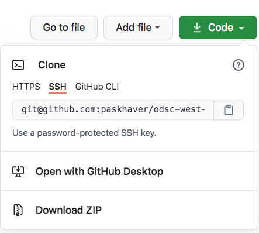
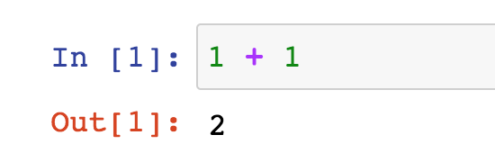

# odsc-west-2020-getting-started-with-pandas

Welcome to Getting Started with Pandas for Data Analysis!

This [3-hour training](https://odsc.com/speakers/getting-started-with-pandas-for-data-analysis/)
will show you the basics of the powerful pandas library for data analysis from scratch. 
The training will take place virtually on Tuesday, October 27th at 9:30AM PDT as 
part of [ODSC West](https://odsc.com/california/) (Open Data Science Conference).

This GitHub repository contains the complete source code and CSV datasets that we'll be using 
during the training. The 3 Jupyter Notebooks (`.ipynb` files) contain the code that I'll
be writing out manually during the session. You are welcome to follow along with
the completed code, or write it out yourself.

## Downloading the Content

The easiest way to download the files is to click on the green **Code** button near the 
top of this page and select **Download Zip**. Unzip the zip file in your directory
of choice.

## Prerequisites: Python, Pandas, and Jupyter Notebook

There are 3 tools you'll need to install to follow along with the training: the core Python
programming language upon which pandas is built, the pandas library itself,
and Jupyter Notebook, the development environment in which we'll be writing our code.

The easiest way to setup ALL these tools in a single step is to install
the Anaconda distribution. The Anaconda distribution is a software bundle that
installs Python + 100+ libraries for data science (including pandas) in one fell swoop. 
You don't **need** all 100 of them but this solution avoids a more complex installation 
process that requires fetching pieces individually.

## Installing Anaconda

### Mac Users
1) Head to [https://www.anaconda.com/products/individual](https://www.anaconda.com/products/individual).
2) Click the Download button to navigate to the Anaconda Installers section.
3) Download the correct installer for your operating system.
4) Launch the installer and follow its instructions. Accept the licensing agreement and choose
your installation directory.
5) Wait until the installation completes and close the installer.
6) Open the Terminal application. The easiest way to do so is to use the Spotlight
Search feaure. Use Command + Space to bring up Spotlight Search, then search for "Terminal".
7) Inside the Terminal window, you should see the word "base" in parentheses to the left
of the directory in which the Terminal is currently. Execute the command `jupyter notebook`
to launch the Jupyter Notebooks application.
8) Navigate to the directory  on your computer in which you unzipped the zip file
you downloaded here.
9) Feel free to click into any of the Notebooks (they have the `ipynb` extension) and 
run the code.

### Windows Users
1) Head to [https://www.anaconda.com/products/individual](https://www.anaconda.com/products/individual).
2) Click the Download button to navigate to the Anaconda Installers section.
3) Download the correct installer for your operating system.  If you're uncertain whether your computer is 
32-bit or 64-bit, go to the Start menu and search for the "Control Panel" app. Inside the Control Panel,
select the "System and Security" tab. In the page that appears, look for the setting of
"System type". The value for it will say either "32-bit" or "64-bit"
4) Launch the installer and follow its instructions. Accept the licensing agreement and choose
your installation directory.
5) Wait until the installation completes and close the installer.
6) Use the Start menu to search for and open the Anaconda Prompt application.
7) Inside the window that ops up, you should see the word "base" in parentheses to the left.
Execute the command `jupyter notebook`
to launch the Jupyter Notebooks application
8) Navigate to the directory on your computer in which you unzipped the zip file
you downloaded here.
9) Feel free to click into any of the Notebooks (they have the `ipynb` extension) and 
run the code.

## Basics of Jupyter

A Jupyter Notebook consists of multiple cells, each of which contains either a chunk of code
or some non-code content (header, text, picture, etc.). 

Click into a code cell and press Shift + Enter to execute it. The output of the cell
will be visible immediately below the code. 

The output will show **the last evaluation**
inside the cell.